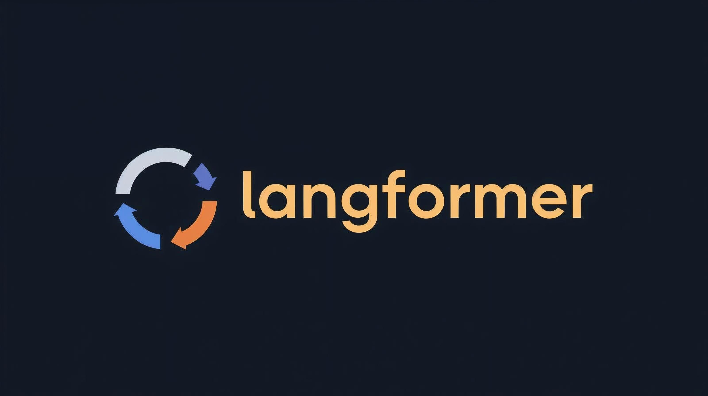
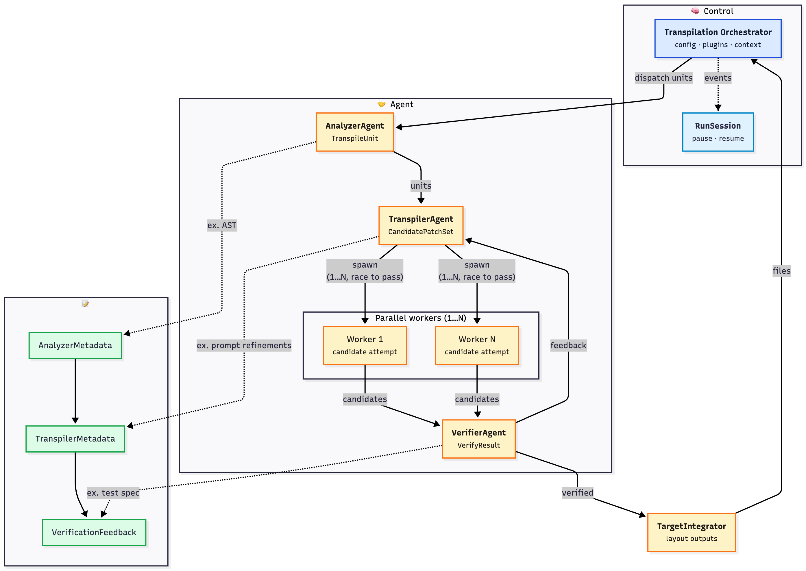

<p align="center"></p>

## `langformer` — Language-Agnostic Transpilation

The `langformer` library is an open-source, agentic transpilation framework for converting source programs into equivalent implementations in a different language or runtime. It draws inspiration from Meta's [KernelAgent](https://github.com/meta-pytorch/KernelAgent) project and generalizes the core concepts to agnostically orchestrate LLM-based refactoring, multi-attempt code generation, and verification feedback loops for arbitrary code-to-code transformations.

See [**Quickstart**](#-quickstart) for usage and installation.

## Architecture at a Glance

<p align="center">
  
</p>

See [`langformer_spec.md`](langformer_spec.md) for a full technical specification.

### Why Langformer

- **Parallel verification races** – the TranspilerAgent can spawn 1…N workers per unit that race to pass verification, with dedup + stream logging.
- **Session-aware orchestration** – `RunSession` captures manifests, streams, and artifacts so long-running jobs can pause/resume without losing context.
- **Centralized Prompt Task Layer** – every LLM call flows through overridable templates + prompt fills, making guidance auditable and easy to customize.
- **Plugin-first surfaces** – register languages, planners, delegates, oracles, and runtime adapters for project-specific behavior.

### Overview

1. **TranspilationOrchestrator** loads config, imports plugin modules, builds an `IntegrationContext`, and manages RunSession metadata.
2. **AnalyzerAgent** partitions source code into `TranspileUnit`s and emits `AnalyzerMetadata` (e.g., AST, entrypoints).
3. **TranspilerAgent** renders prompts via the template + fill registry, calls the selected LLM provider, and records `TranspilerMetadata` (prompt refinements, stream IDs, dedup info).
4. **VerifierAgent** executes configured strategies/oracles, producing `VerifyResult` + `VerificationFeedback` (test specs, diagnostics). Failures feed back into the transpiler for iterative refinement.
5. **TargetIntegrator** writes final files to the layout output path once verification passes.
6. **RunSession** stores events, manifests, and artifacts so runs can resume or be audited later.

---

## 🚀 Quickstart

```bash
git clone https://github.com/martelogan/langformer.git
cd langformer

# Recommended to use project virtual env
# uv venv
# source .venv/bin/activate

# install dependencies
uv sync

# run simple example
# LLM use requires on config in .env
# e.g. OPENAI_MODEL and OPENAI_API_KEY
uv run python examples/simple_py2rb_transpiler/run.py --config configs/simple_py2rb.yaml --verify
```

For dev environment setup

```bash
# for dev environment setup (e.g. pytest)
uv pip install -e ".[dev]"

# Recommended lint/test sweep
uv run ruff check .
uv run pyright
uv run pytest
```

**Environment**

- Python 3.10+
- [`uv`](https://docs.astral.sh/uv/getting-started/installation/) (recommended) or `pip`
- Optional: `OPENAI_API_KEY`, `ANTHROPIC_API_KEY`, or custom provider credentials
- `.env` is auto-loaded; see [`.env.example`](.env.example) for hints

### Run an example Langformer transpiler (Python → Ruby)

```bash
uv run python examples/simple_py2rb_transpiler/run.py \
    --config configs/simple_py2rb.yaml \
    --verify
```

With a real LLM provider configured (set `OPENAI_API_KEY`, `ANTHROPIC_API_KEY`, etc.), Langformer will prompt the target language plugin, compile/execute the generated code, and compare outputs. With no API key, the fallback echoes the source so you can test the pipeline deterministically.

**CLI-driven `langform` transpilation**

```bash
uv run langform path/to/source.py \
  --target build/out.rs \
  --config configs/python_to_rust.yaml \
  --verify
```

Langformer reads `transpilation.*` settings from the YAML file and lets CLI flags override any value (LLM provider, planner, etc.).

---

## ✨ Capabilities

| Capability | Description |
| --- | --- |
| **Language-agnostic core** | Lightweight Python/Ruby/Rust plugins ship out of the box; register your own with `register_language_plugin`. |
| **Prompt templating** | Jinja2 templates (`langformer/prompting/templates/*.j2`) plus a prompt-fill registry make all injected instructions discoverable and overridable. |
| **LLM provider abstraction** | OpenAI, Anthropic, Relay, or deterministic `EchoProvider`—plus support for custom base URLs, streaming, and worker fan-out. |
| **Verification strategies** | Exact, structural, execution (sandbox runners), or custom oracles registered via `OracleRegistry`. Generated tests land in `VerifyResult.feedback.tests`. |
| **Artifact manager** | Stage-specific directories (`analyzer/`, `transpiler/`, `verifier/`) with manifests mirrored into `candidate.metadata`. |
| **Typed config** | `langformer.configuration.TranspilationSettings` normalizes layout, LLM, runtime, artifacts, and component overrides. |
| **Plugin loading** | `transpilation.plugins.modules|paths` auto-import planners, delegates, or custom prompt/oracle packages. |
| **Worker pipeline** | Optional worker fan-out (variants per unit) with stream logging and dedup callbacks. |

---

## 📦 Examples

| Example | Path | Highlights |
| --- | --- | --- |
| Simple Python→Ruby | `examples/simple_py2rb_transpiler/` | Layout-driven IO, OpenAI defaults, custom verification oracle, deterministic test harness. |
| Advanced Py→Rb (WIP) | `examples/advanced_wip_py2rb_transpiler/` | Sandbox for richer prompt customizations and translation hints. |
| KernelAgent Delegate | `examples/kernel_agent_delegate/` | Planner stores router decisions; delegate dispatches to Langformer or KernelAgent |
| DSPy Py→Rb Agent | `examples/dspy_py2rb_transpiler/` | Standalone DSPy transpiler + optimizer that logs verifier feedback, feeds Ruby test results into DSPy metadata, and emits artifacts for every attempt. |
| DSPy Prompt Demo | `examples/barebones/transpile_with_dspy/` | Registers Prompt Task Layer renderers plus a DSPy engine and exercises both pathways. |

Run the simple example end-to-end:

```bash
uv run python examples/simple_py2rb_transpiler/run.py \
  --config configs/simple_py2rb.yaml \
  --verify
```

---

## ⚙️ Configuration Cheat Sheet

```yaml
transpilation:
  source_language: python
  target_language: ruby
  layout:
    relative_to: config
    input:
      path: examples/simple_py2rb_transpiler/inputs/sample_module.py
    output:
      kind: directory
      path: examples/simple_py2rb_transpiler/outputs/generated
      extension: rb
  llm:
    provider: openai
    model: gpt-4o-mini
    streaming:
      enabled: true
      mode: file
  agents:
    max_retries: 4
    parallel_workers: 1
    prompt_dir: custom/prompts   # optional override
  verification:
    strategy: custom_oracle
    oracle:
      type: simple_py2rb
  runtime:
    enabled: true
    run_root: .transpile_runs
  artifacts:
    root: .transpile_runs/artifacts
  components:
    transpiler_agent: mypkg.agents.CustomTranspilerAgent  # optional
  plugins:
    modules:
      - examples.simple_py2rb_transpiler
```

### LLM provider settings

- `transpilation.llm.base_url` overrides the API endpoint for OpenAI/Relay-compatible providers (useful for gateways such as Fireworks, Relay, or self-hosted proxies). The CLI exposes the same toggle via `--api-base`.
- `transpilation.llm.api_key_env` decides which environment variable supplies the API key (also configurable with `--api-key-env`).
- Both provider-based and model-based configs honor these fields, so you can specify only a `model` and still point it to a custom hostname.
- `langformer.llm.utils.configure_proxy_environment()` copies `LANGFORMER_PROXY_OVERRIDE` (when set) into the standard HTTP/HTTPS proxy variables before providers initialize, so custom scripts can inject proxy settings consistently.

**Tips**

- All keys under `transpilation.llm` and `transpilation.agents` can be overridden via CLI flags (`--llm-provider`, `--model`, `--planner`, etc.).
- Use `prompt_dir` to shadow built-in templates (Langformer searches override dirs before `langformer/prompting/templates`).
- Store custom planners, oracles, or prompt fills in a package and list it under `plugins.modules`.

---

## 🔌 Extending Langformer

| Task | How |
| --- | --- |
| New language plugin | Implement `LanguagePlugin` and register with `register_language_plugin("swift", SwiftPlugin)`. |
| Custom analyzer/transpiler/verifier | Point `transpilation.components.source_analyzer` (etc.) at your class. |
| Prompt customization | Add a directory to `transpilation.agents.prompt_dir` and/or register new prompt fill providers via `prompt_fills.register(func)`. |
| Verification oracle | `OracleRegistry.register("my_oracle", factory)` and reference it in config (`verification.oracle.type`). |
| Planner/delegate | Ship a module that registers planner/ delegate classes and include it under `transpilation.plugins.modules`. |
| Runner integration | Provide a custom runtime adapter + sandbox runner settings under `transpilation.verification.runner`. |

### Prompt Task Layer

Every call into an LLM flows through a lightweight Prompt Task Layer so
agents can describe **what** they need independently of **how** the prompt is
executed. A `PromptTaskSpec` (see `langformer/prompting/types.py`) captures the
task kind, ID, and arbitrary metadata (source code, hints, verifier feedback,
etc.). Renderers such as `JinjaPromptRenderer`
(`langformer/prompting/backends/jinja_backend.py`) turn that spec into a
`RenderedPrompt`, while agents normalize provider responses into a
`PromptTaskResult`. Use `register_renderer` / `register_engine`
(`langformer/prompting/registry.py`) to map kinds to renderers or engines such
as `BasicDSPyTranspiler`; the default transpiler agent will render prompts and
call your provider, while DSPy-aware agents can bypass that entirely. See
`examples/transpile_with_dspy` for the registry walkthrough and
`examples/dspy_py2rb_transpiler` for a full pipeline that wires a DSPy agent,
custom oracle, and ArtifactManager-backed optimizer together.

### DSPy Py→Rb Example

Run the full DSPy example end-to-end:

```bash
uv run python examples/dspy_py2rb_transpiler/run.py \
  --config configs/dspy_py2rb.yaml \
  --verify
```

The `Py2RbDSPyTranspilerAgent` implements the `TranspilerAgent` protocol from
scratch: it builds `PromptTaskSpec`s, injects API/style metadata, and routes
the spec through a DSPy program (`examples/dspy_py2rb_transpiler/dspy_components.py`)
that first summarizes the Python module and then generates Ruby given the
style guide + verifier requirements. The oracle
(`examples/dspy_py2rb_transpiler/oracle.py`) executes the Python module, runs
the generated Ruby through the same cases, and then invokes Minitest suites for
the target namespace; failures (syntax errors, mismatched outputs, test logs)
are written to the `ArtifactManager` and provided to the DSPy optimizer. The
optimizer (`DSPyFeedbackOptimizer`) turns those verifier artifacts into
structured metadata (`style_guide`, `verifier_requirements`, and
`verification_feedback`) so the next attempt automatically incorporates the
oracle guidance. The companion test (`examples/tests/test_dspy_py2rb.py`)
exercises the full feedback loop.

### Prompt templates

Langformer renders all LLM prompts from Jinja2 templates under `langformer/prompting/templates/` via the Prompt Task Layer:

- `transpile.j2` – initial generation prompt (includes common guidelines).
- `refine.j2` – refinement prompt used when verification fails.
- `guidelines.j2` – reusable snippet injected into other templates.
- `tests.j2` – reserved for extensions that synthesize regression tests.

The `PromptManager` automatically layers user overrides on top of the built-in templates. To customize prompts, place your `.j2` files in a directory and set `transpilation.agents.prompt_dir` to that path. Templates with matching filenames in your directory shadow the defaults, while missing files fall back to the packaged versions. You can inspect the active library via `PromptManager.list_templates()` or by reading `LLMConfig.prompt_paths`.

Prompt variables (guidelines, style targets, plugin hints, layout/build summaries, etc.) are populated via a registry of “prompt fill” providers at `langformer.prompting.fills.prompt_fills`. Each provider receives a `PromptFillContext` describing the unit, integration context, attempt number, and source/target plugins, and returns a `dict` merged into the template payload. You can register or unregister additional fills at runtime—for example:

```python
from langformer.prompting.fills import prompt_fills, PromptFillContext

def add_custom_flag(ctx: PromptFillContext) -> dict[str, object]:
    return {"custom_guidance": f"Prefer {ctx.target_language} 3.12 features"}

prompt_fills.register(add_custom_flag)
```

Because every prompt input flows through this registry, the set of instructions Langformer (or your overrides) supplies to the LLM is centralized and easy to audit.

Need to tweak hints for a whole language or a specific translation pair without writing a full fill function? Use the helper utilities:

```python
from langformer.prompting.fills import register_target_language_hints, register_translation_hints

register_target_language_hints("julia", ["Prefer multiple dispatch and pure functions."])
register_translation_hints("python", "julia", ["Map dataclasses to mutable structs when mutations are required."])
```

> **Built-in sample plugins:** Langformer bundles `LightweightPythonLanguagePlugin`, `LightweightRubyLanguagePlugin`, and `LightweightRustLanguagePlugin` purely as scaffolding so the framework runs out of the box. They intentionally keep behavior minimal; production projects should ship their own plugins and attach richer hints through the helper APIs above.

### Custom language plugins

Register additional languages (or override the built-ins) by calling `langformer.languages.register_language_plugin`. Pair that with the prompt-fills helpers above to attach language-specific hints:

```python
from langformer.languages import LanguagePlugin, register_language_plugin
from langformer.prompting.fills import register_target_language_hints

class SwiftLanguagePlugin(LanguagePlugin):
    language_name = "swift"
    # implement parse/compile/execute

register_language_plugin("swift", SwiftLanguagePlugin)
register_target_language_hints(
    "swift",
    [
        "Favor struct/value semantics unless a reference type is required.",
        "Expose public APIs via protocol extensions mirroring the Python surface area.",
    ],
)
```

Inside your plugin module you can also call `register_translation_hints` (for source→target specifics) or `prompt_fills.register(...)` to contribute a fully custom payload builder—the base plugin interface purposefully has no prompt hook so that all LLM instructions stay discoverable and overridable via the registry.

## Verification Oracles

Langformer ships several strategies in `langformer.verification.strategies`:

- `ExactMatchStrategy`: compare source/target source text (useful for smoke tests).
- `ExecutionMatchStrategy`: run both versions through a `RunnerManager` and compare stdout/return values.
- `CustomOracleStrategy`: call a user-provided oracle defined in the `IntegrationContext`.

To register a custom oracle:

```python
from langformer.verification.oracles import OracleRegistry
from langformer.types import Oracle, VerifyResult

def build_my_oracle(config):
    def verify(source, target, metadata):
        # ... run target code somewhere ...
        passed = True
        return VerifyResult(passed=passed, details={"unit": metadata["unit"]})
    return Oracle(verify=verify)

OracleRegistry.get_registry().register("my_oracle", build_my_oracle)
```

Then in config:

```yaml
verification:
  strategy: custom_oracle
  oracle:
    type: my_oracle
    some_flag: true
```

## Extensibility Map

| Extension | Base class / module | Notes |
|-----------|--------------------|-------|
| Language plugins | `langformer.languages.register_language_plugin` | Bundle your own runtime adapters; augment prompts via `register_target_language_hints` / `register_translation_hints`. |
| Source analysis | `langformer.agents.analyzer.DefaultAnalyzerAgent` | Plugins can override `partition_units`/`parse` to control how the orchestrator slices work. |
| Context builder | `langformer.orchestration.context_builder.ContextBuilder` | Receives `IntegrationSettings` + `LayoutPlan` objects so you can wire oracles/layout metadata deterministically. |
| Transpiler agent | `langformer.agents.transpiler.DefaultTranspilerAgent` (prompt+provider) / `BasicDSPyTranspilerAgent` (DSPy engine) | Swap prompts, retry strategies, or drop in any `TranspilerAgent`-compatible class. |
| Verification | `langformer.verification` strategies + `langformer.runtime.runner` | Use execution-match, sandbox, or register your own oracle via `langformer.verification.oracles`. |
| Target integration | `langformer.orchestration.target_integrator.TargetIntegrator` | Handles writing verified code to disk; override if your target needs multi-file composition. |
| Planners | `langformer.preprocessing.planners.ExecutionPlanner` | Decide whether to run Langformer directly or hand work to a delegate. |
| Delegates | `langformer.preprocessing.delegates.ExecutionDelegate` | Implement alternative pipelines (e.g., the vendored KernelAgent example). |

All of the rows above live under `langformer/…` and follow simple registration patterns so downstream projects can hook in without copying the framework.

> **Shared LLMConfig:** Analyzer, transpiler, and verifier constructors all receive the same `LLMConfig` object (LLM provider, `PromptManager`, prompt search paths) so custom agents automatically share prompt assets and provider settings.

### Declaring custom components via config

Langformer can load user-defined classes directly from configuration using dotted paths under `transpilation.components`:

```yaml
transpilation:
  source_language: python
  target_language: rust
  components:
    source_analyzer: mypkg.custom.CustomSourceAnalyzer
    context_builder: mypkg.custom.CustomContextBuilder
    transpiler_agent: mypkg.custom.CustomTranspilerAgent
    verification_agent: mypkg.custom.CustomVerificationAgent
    target_integrator: mypkg.custom.CustomTargetIntegrator
```

Each class is instantiated with the same arguments as Langformer's default implementations (e.g., analyzer gets `language_plugin`, `llm_config`, and its config block; transpiler receives source/target plugins plus the shared `LLMConfig`; verifiers see `strategy`, plugins, and `llm_config`). This makes it straightforward to plug advanced analyzers or domain-specific transpiler loops straight into the orchestrator without editing Langformer's core.

Custom context builders should implement:

```python
from langformer.configuration import IntegrationSettings
from langformer.types import IntegrationContext, LayoutPlan

class MyContextBuilder:
    def build(
        self,
        integration: IntegrationSettings,
        layout: LayoutPlan,
    ) -> IntegrationContext:
        oracle = self._maybe_build_oracle(integration.oracle)
        return IntegrationContext(
            target_language=integration.target_language,
            layout=layout,
            build=integration.build,
            oracle=oracle,
            api_mappings=integration.api_mappings,
            feature_spec=integration.feature_spec,
        )
```

This keeps downstream builders strongly typed while still allowing full customization.

## Planners & Delegates

Langformer’s planner registry lets you choose how to route work:

- `default`: always run the Langformer pipeline.
- `kernel_agent_auto`: (example) reuses the KernelAgent router and can delegate to the vendored legacy pipeline (`examples/kernel_agent_delegate`).

Delegates implement the execution contract (`execute()` + optional `verify()`). The bundled `kernel_agent_delegate` demonstrates how to plug existing systems into Langformer without modifying core code. If you import `examples.kernel_agent_delegate`, the planner/delegate/oracle are auto-registered.

To build your own planner or delegate, subclass the base classes in `langformer.preprocessing.planners` / `langformer.preprocessing.delegates` and register them at import time.

## Development Workflow

```bash
uv pip install -e ".[dev]"
uv run ruff check --select I --fix
uv run ruff check .
uv run pyright
uv run pylint --errors-only langformer
uv run pytest
```

During development, every run writes artifacts to `.transpile_runs/`. Clean them up as needed.

- `pyright` is configured via `pyproject.toml` to focus on the core Langformer modules and the simple Python→Ruby example, so a plain `uv run pyright` type-checks the codebase without being distracted by the vendored KernelAgent copy.
- `pylint --errors-only` runs quickly and only raises actionable errors; run it before landing changes to catch obvious regressions without getting buried in style noise.
- `ruff check --select I --fix` enforces import ordering (isort-equivalent) prior to the main lint run to keep diffs tidy.

### Artifacts, metadata, and tests

- Configure per-run artifact roots via `transpilation.artifacts` (`root`, `analyzer_dir`, `transpiler_dir`, `verifier_dir`). The orchestrator wires these into an `ArtifactManager`, which agents can access through `llm_config.artifact_manager`; the active `IntegrationContext` exposes the same object.
- Analyzer metadata now lives on `unit.metadata`, a mapping-friendly wrapper so you can continue using `unit.metadata["foo"] = bar` while keeping structured state.
- Transpiler metadata is exposed via `candidate.metadata` (aliases to `candidate.notes` for compatibility). Verifier feedback uses `VerifyResult.feedback` (also available as `result.details`), and any generated tests can be stored in `VerifyResult.feedback.tests`.
- During verification, any tests described in `feedback.tests` are materialized under the verifier artifact directory and mirrored in `candidate.tests`, making them easy to inspect or re-run later.

## 📄 License

Apache-2.0. See [LICENSE](LICENSE) for full terms.

---

## Acknowledgments

Several concepts in Langformer were inspired or adapted from https://github.com/meta-pytorch/KernelAgent . All attributions have been preserved in source files as relevant.
